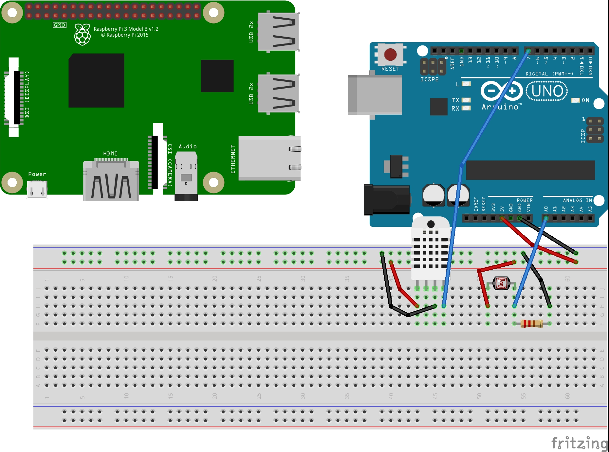

# Hardware
---
## Components
### Single Board Computers and Microcontrollers
* Raspberry Pi 3 model B
* Arduino Uno

### Sensors

---
## Setup
* Download Arduino IDE from [here](https://www.arduino.cc/en/Main/Software).

   The IDE allows for easy uploading of programs to the Arduino via USB
* Prepare the Raspberry PI.
    - Download Raspbian from [here](https://www.raspberrypi.org/downloads/raspbian/).

   Raspbian is an Debian based version of Linux optimized for the Raspberry Pi hardware.
    - Write the Raspbian image to a microSD card

   A good tool to write the image for Mac OS is [Etcher](https://etcher.io/)
    - Plug Pi up to a monitor, keyboard, and power.
    - Initially username will be 'pi' and password will be 'raspberry'
    - Setting up wifi for the Pi

   From the console we can scan for wifi networks using iwlist
```console
pi@raspberrypi:~$ sudo iwlist wlan0 scan
```
   This will output quite alot of information on local wifi networks, pay
attention to the ESSID values they are the names of the wifi networks.
Then we will add the network information to the 'wpa_supplicant.conf' file

```console
pi@raspberrypi:~$ sudo nano /etc/wpa_supplicant/wpa_supplicant.conf
```
   We should be able to go to the bottom of this file and add
```console
network={
    ssid='essid name from earlier'
    psk='the password for the network'
}
```
   Sometimes a wpa_supplicant.conf file can be placed in the boot partition of the memory card to get connected to wifi.

<p align="center">
    
</p>


## Goal
Collect data from a variety of sensors. The Arduino is used because it can
deal with both analog and digital sensors. The Arduino simply reads data
from the sensors at a set time interval and then transmits this data 
through serial communication to a Raspberry Pi. The Pi takes this data,
puts it into JSON form, and sends it through POST requests to a server
deployed on Heroku.
